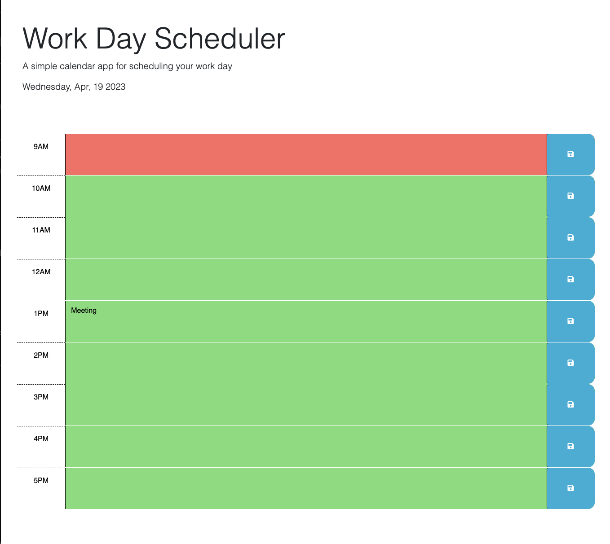

# Work Day Scheduler

## Description
Welcome to event scheduler project. This project helps bootcamp students to learn and understand more about third parties api such as jQuery. Feel free to use, inspect or make any changes to this project.
## Installation
First create a new repository in Github by going to Settings->Repositories->New->Choose a name, make it public and choose a license.
Next, copy this repository to your local computer by opening the github and copying your repository link and then going to terminal and making sure you're at the desired folder to add it. At the terminal use these commands: git status->git clone "repository link".
Next go to my github and download the zip folder and by using GUI or your cursor you can add them in the folder you created.

## Usage
You can use this project by going to my Github account and clicking on my project repository and runnning the deployed page. 
This is how my page looks: 

Click here for deployed page: <a href="https://ftahira1.github.io/Work-day-scheduler/">Work Day Scheduler</a>

Click here for my Github repository: <a href="https://github.com/ftahira1/Work-day-scheduler.git">Github</a>

## Credits
N/A

## License
MIT license
Copyright (c) 2023 ftahira1

Permission is hereby granted, free of charge, to any person obtaining a copy
of this software and associated documentation files (the "Software"), to deal
in the Software without restriction, including without limitation the rights
to use, copy, modify, merge, publish, distribute, sublicense, and/or sell
copies of the Software, and to permit persons to whom the Software is
furnished to do so, subject to the following conditions:

The above copyright notice and this permission notice shall be included in all
copies or substantial portions of the Software.

THE SOFTWARE IS PROVIDED "AS IS", WITHOUT WARRANTY OF ANY KIND, EXPRESS OR
IMPLIED, INCLUDING BUT NOT LIMITED TO THE WARRANTIES OF MERCHANTABILITY,
FITNESS FOR A PARTICULAR PURPOSE AND NONINFRINGEMENT. IN NO EVENT SHALL THE
AUTHORS OR COPYRIGHT HOLDERS BE LIABLE FOR ANY CLAIM, DAMAGES OR OTHER
LIABILITY, WHETHER IN AN ACTION OF CONTRACT, TORT OR OTHERWISE, ARISING FROM,
OUT OF OR IN CONNECTION WITH THE SOFTWARE OR THE USE OR OTHER DEALINGS IN THE
SOFTWARE.
